# PixFray



Pixel fighters for Twitch chat. Every viewer who chats gets a small character on your stream.
Viewers challenge each other in chat, and the duel plays out on the overlay, with Elo ranks, hats
and pets. Viewers can also turn any picture into their own sprite, which a mod approves.

Free and open source (MIT). Runs on one Cloudflare Worker on the free plan.

- Live site: https://pixfray.xyz
- Test site: https://staging.pixfray.xyz

## Add it to your channel

1. Sign in on https://pixfray.xyz/start/ with the Twitch account you stream on.
2. Follow the **Stream setup** checklist it opens. It takes about 10 minutes.

You need OBS (or another app with a browser source) and a StreamElements account. You can turn
PixFray off at any time; fighters and ranks are kept.

Step-by-step guide: [docs/STREAMER_SETUP.md](docs/STREAMER_SETUP.md).

## Chat commands

| Command | What it does |
|---|---|
| `!challenge @viewer` | Challenge someone to a duel |
| `!fight` / `!decline` | Accept or refuse a challenge |
| `!rematch` | Challenge your last opponent again |
| `!elo` / `!ranks` | Your rank, and the top fighters |
| `!checkin` | Once per stream: earn an upgrade point |
| `!wallet` / `!pay @name 10` | Your PixFray dollars, and sending some |
| `!look` / `!pet` / `!fray` | Your fighter's page, its pet, how to join |

How duels are rolled, dollars and limits: [docs/DUELS.md](docs/DUELS.md).

## Run it locally

```bash
bun install
```

```bash
bun run dev
```

Needs [Bun](https://bun.sh) 1.4+, Node 22.18+ and a `.dev.vars` file first. See
[docs/DEVELOPMENT.md](docs/DEVELOPMENT.md).

## Docs

- [Streamer setup](docs/STREAMER_SETUP.md)
- [How duels work](docs/DUELS.md)
- [Pages and overlay options](docs/PAGES.md)
- [Development and tests](docs/DEVELOPMENT.md)
- [Run your own copy](docs/SELF_HOSTING.md)
- [All docs](docs/README.md)

## License

MIT for the software; the character artwork is CC0. See
[docs/ASSET_LICENSES.md](docs/ASSET_LICENSES.md). No Twitch or OBS credentials are included.
